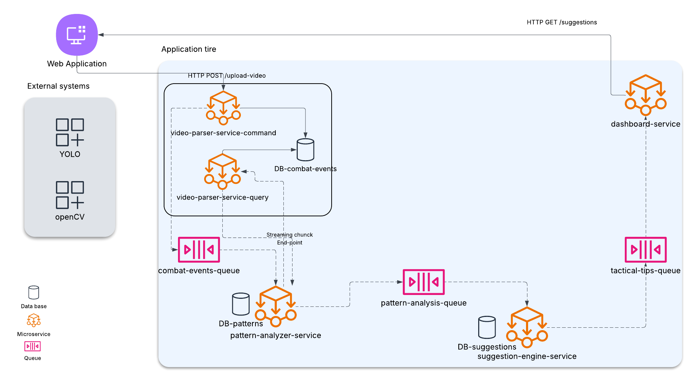

# Diagrama de Arquitectura

Este diagrama representa el flujo completo del sistema Combat Analysis, desde la carga de video hasta la visualización de tácticas sugeridas.

## 🧭 Componentes Principales

- **Application Tier**: contiene los microservicios que procesan, analizan y recomiendan.
- **Messaging Layer**: RabbitMQ con tres colas: `combat-events-queue`, `pattern-analysis-queue` y `tactical-tips-queue`.
- **Data Layer**: PostgreSQL y MongoDB segmentados por contexto (`events`, `patterns`, `suggestions`).
- **Frontend**: un dashboard que consume el endpoint `/suggestions` y responde a eventos en tiempo real.

Cada microservicio se comunica mediante colas, favoreciendo la asincronía, la escalabilidad y la modularidad.

